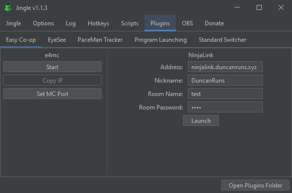

# Jingle Easy Co-op Plugin

Easy Co-op is a plugin that provides convenient access to tools for playing co-op Minecraft speedruns.

Included is [e4mcbiat](https://github.com/duncanruns/e4mcbiat?tab=readme-ov-file#e4mc-but-its-a-tool) for opening lan
worlds to anyone, and [NinjaLink](https://github.com/DuncanRuns/NinjaLink?tab=readme-ov-file#ninjalink) for viewing
other player's Ninjabrain Bot data. For those who don't use Jingle, or are on another operating system, you can download
those individual tools instead.

## Speedrun Legality

NinjaLink isn't included directly in the plugin download, but can be downloaded and launched through the Easy Co-op
plugin tab. It isn't included as NinjaLink is a tool that required legalization for runs on speedrun.com, and embedding
it into the plugin would mean the plugin also requires legalization for runs on speedrun.com. Since NinjaLink has been
legalized for runs, and Easy Co-op simply downloads and launches that same program, there is no legalization concern.
e4mcbiat on the other hand does not require legalization, so it is embedded in the plugin and requires no additional
downloading process.

## Developing

The GUI is made with the IntelliJ IDEA form designer, if you intend on changing GUI portions of the code, IntelliJ
IDEA must be configured in a certain way to ensure the GUI form works properly:

- `Settings` -> `Build, Execution, Deployment` -> `Build Tools` -> `Gradle` -> `Build and run using: IntelliJ Idea`
- `Settings` -> `Editor` -> `GUI Designer` -> `Generate GUI into: Java source code`